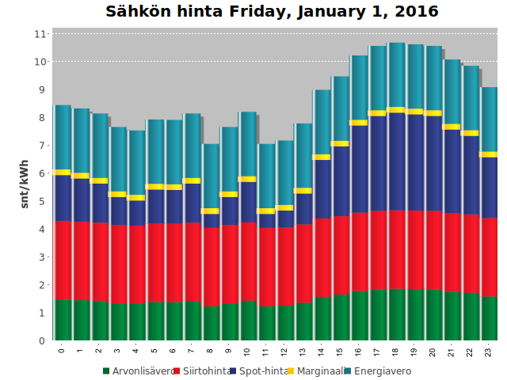

# Electric Binding

Calculates the electricity prices of the property connected to the grid and provides cheapness and consumability info.



Different tariffs, energy tax, value added tax, transfer, sales, spot and margin prices are taken in to account using any currency per energy unit, e.g. _¢/kWh_ or _¥/MWh_.

## Supported Things

- [`price`: Bridge](#price-bridge-configuration) calculates and provides final consumer prices and draws graphs of them. It needs a one child thing to provide transfer price and one child thing or bridge to provide selling price.
  - [`fixed`: Thing](#fixed-thing-configuration) provides the configured transfer and/or sales prices based on the fixed tariff electricity to the [`price` bridge](#price-bridge-configuration).
  - [`spot`: Bridge](#spot-bridge-configuration) provides exchange electricity spot prices to the [`price` bridge](#price-bridge-configuration). It needs a one child thing as a data source:
     - [`entsoe`: Thing](#entsoe-thing-configuration) reads spot prices from [ Transparency Platfom](https://transparency.entsoe.eu/) and provides them to the [`spot` bridge](#spot-bridge-configuration).

### Planned things

- `night`: Offers configured transfer and/or sales prices based on the night electricity tariff.
- `season`: Offers configured transfer and/or sales prices based on the season electricity tariff.
- `consumption`: A bridge offering electricity consumptions. Needs a thing for the data source:
  - `meter`: Reads current power from any electricity meter which provides signal or blinking LED.
  - `fingrid`: Reads Finnish consumers consumptions from [ Datahub](https://www.fingrid.fi/en/electricity-market/datahub/) 
- `production`: A bridge offering electricity production (e.g. from solar panels). Needs a thing for the data source.
  - `generator`: Controls electric generator (e.g. at blackout).
- `capacity`: A bridge offering electricity capacity (e.g. in electric car, batteries or UPS). Needs a thing for the data source.

## Discovery

Always discovers the `price` bridge and configures following parameters:

- `currency`: Defines system default currency.
- `subunit`: Defines localized subunit symbol if the currency is any dollar, euro or any pound.
- `energy`: Defines `kWh` if using the currency subunit.
- `tax`: Defines the country specific energy tax, if known.
- `general`: Defines the country specific general VAT rate, if known.
- `sales`: Defines the country specific electricity sales VAT rate, if known.
- `precision`: Defaults to seven digits.
- `scale`: Defaults to two digits.

Discovers an `entsoe` thing in Europe and configures following parameters:

- `area`: Defines the [Energy Identification Code](https://transparency.entsoe.eu/content/static_content/Static%20content/web%20api/Guide.html#_areas) of the current country.
- `token`: **You need to request your own [Security Token](#steps-to-request-access-to-the-entso-e-transparency-platform-api) before accessing data.**

Discovers a `spot` bridge if `entsoe` is discovered and configures following parameters:

- `resolution`: Now _one hour_ and later _15 minutes_, when one is put into use somewhere.
- `margin`: Enter the margin price of your electricity sales company.

Add the `entsoe` thing and the `spot` bridge only if you have a stock exchange electricity!

## Thing Configuration

### `price` Bridge Configuration

| Name      | Type    | Description                                                                                                                 | Default | Required | Advanced |
|-----------|---------|-----------------------------------------------------------------------------------------------------------------------------|--------:|:--------:|:--------:|
| currency  | text    | [Currency code](https://en.wikipedia.org/wiki/ISO_4217) of the used currency in the parameters, read data and output units. |     N/A |    no    |    no    |
| subunit   | text    | Localized currency 1⁄100 subunit symbols (e.g. `c`, `¢`, `p`, `snt`) if used in the parameters and output.                  |     N/A |    no    |    no    |
| energy    | text    | Energy unit (e.g. `MWh`, `kWh`) used in the parameters and output.                                                          |   `MWh` |   yes    |    no    |
| tax       | decimal | Energy tax in the units selected above. Hidden if zero.                                                                     |   `0.0` |   yes    |    no    |
| vat       | integer | General VAT rate percent which is included in the prices. Hidden if zero.                                                   |     `0` |   yes    |    no    |
| sales     | integer | Electricity sales VAT rate percent. Defaults to _General VAT rate_.                                                         |     N/A |    no    |   yes    |
| precision | integer | Digits used for mathematical operations (divisions).                                                                        |     `7` |   yes    |   yes    |
| scale     | integer | Fraction digits of the final rounded values. Not applied for percents.                                                      |     `2` |   yes    |   yes    |

### `fixed` Thing Configuration

Add `fixed` thing per your _fixed tariff_ electricity company under [`price` bridge](#price-bridge-configuration) and it's recommended to label them using those company names.

| Name     | Type    | Description                                                                                                      | Default | Required | Advanced |
|----------|---------|------------------------------------------------------------------------------------------------------------------|--------:|:--------:|:--------:|
| selling  | decimal | Selling price of the electricity using the units defined for the [`price` bridge](#price-bridge-configuration).  |     N/A |    no    |    no    |
| transfer | decimal | Transfer price of the electricity using the units defined for the [`price` bridge](#price-bridge-configuration). |     N/A |    no    |    no    |

### `spot` Bridge Configuration

Add only one `spot` bridge under [`price` bridge](#price-bridge-configuration) if you have a stock exchange electricity and it's recommended to label it using the name of your electricity sales company.

| Name       | Type    | Description                                                                                                                                  | Default | Required | Advanced |
|------------|---------|----------------------------------------------------------------------------------------------------------------------------------------------|--------:|:--------:|:--------:|
| margin     | decimal | Margin price of the electricity sales company using the units defined for the [`price` bridge](#price-bridge-configuration). Hidden if zero. |   `0.0` |   yes    |    no    |
| resolution | text    | [Duration](https://en.wikipedia.org/wiki/ISO_8601) between possible price changes.                                                           |  `PT1H` |   yes    |   yes    |

### `entsoe` Thing Configuration

Add only one `entsoe` thing if you live in Europe and have a stock exchange electricity.

| Name  | Type | Description                                                                                                                                                                 | Default | Required | Advanced |
|-------|------|-----------------------------------------------------------------------------------------------------------------------------------------------------------------------------|--------:|:--------:|:--------:|
| token | text | [Security Token](https://transparency.entsoe.eu/content/static_content/Static%20content/web%20api/Guide.html#_authentication_and_authorisation) required to access the API. |     N/A |   yes    |    no    |
| area  | text | Area [Energy Identification Code](https://transparency.entsoe.eu/content/static_content/Static%20content/web%20api/Guide.html#_areas) for which spot prices are read.       |     N/A |   yes    |   yes    |

The `entsoe` thing updates the [`spot` bridge](#spot-bridge-configuration) `resolution` parameter and ensures that the read currency is the same as defined in the [`price` bridge](#price-bridge-configuration).

#### Steps to request access to the ENTSO-E Transparency Platform API

1. Register on the [Transparency Platform](https://transparency.entsoe.eu/).
2. Send an email to <a href="mailto:transparency@entsoe.eu?subject=Restful API access">transparency@entsoe.eu</a> with `Restful API access` in the subject line. Indicate the email address you entered during registration in the email body.
3. The ENTSO-E Helpdesk will make their best efforts to respond to your request within 3 working days.
4. Once access has been granted, after logging in on [Transparency Platform](https://transparency.entsoe.eu/), users will find a button to generate their token under _[My Account Settings](https://transparency.entsoe.eu/usrm/user/myAccountSettings)_ on Transparency Platform.

## Channels

### `price` Channels

| Channel      | Item Type          | Read/Write | Description                                                                             |
|--------------|--------------------|------------|-----------------------------------------------------------------------------------------|
| changed      | DateTime           | Read       | Last electricity price change in local time.                                            |
| cheap        | Switch             | Read/Write | Is the current electricity price defined to be cheap.                                   |
| cheapIf      | Dimmer             | Read/Write | Triggers `cheap` if the `futureScaled` is less than this. Defaults to 50 %.             |
| consume      | Switch             | Read/Write | Is the current electricity price defined to be consumed (to fill e.g. heating needs).   |
| consumeIf    | Dimmer             | Read/Write | Triggers `consume` if the `todayScaled` is less than this. Defaults to 50 %.            |
| current      | Number:EnergyPrice | Read       | Current total electricity price quantity (with unit).                                   |
| future       | String             | Read       | Future prices in [JSON](https://en.wikipedia.org/wiki/JSON) array format.               |
| futureRank   | Number             | Read       | Order number of the future prices from the cheapest to the most expensive.              |
| futureScaled | Dimmer             | Read       | Current price [scaled](https://en.wikipedia.org/wiki/Feature_scaling) by future prices. |
| graph        | Image              | Read       | Future prices drawn in [SVG](https://en.wikipedia.org/wiki/SVG) graph.                  |
| todayRank    | Number             | Read       | Order number of the today prices from the cheapest to the most expensive.               |
| todayScaled  | Dimmer             | Read       | Current price [scaled](https://en.wikipedia.org/wiki/Feature_scaling) by today prices.  |

## Full Example

### Thing Configuration

```java
Bridge electric:price:home  "Electricity price service" @ "Home"    [
        currency="EUR", subunit="snt",  energy="kWh", tax=2.79, vat=24              ] {
  Thing   fixed   ese  "ESE-Verkko Oy"                  @ "Mikkeli" [ transfer=3.4  ]
  Bridge  spot    oomi "Oomi Oy"                        @ "Vantaa"  [ margin  =0.25 ] {
    Thing entsoe  fi   "ENTSO-E Transparency Platform"  @ "Finland" [
            area="10YFI-1--------U",  token="f8c3de3d-1fea-4d7c-a8b0-29f63c4c3454"  ]
  }
}
```

### Item Configuration

```java
Number:EnergyPrice  Electricity_Price "Electricity price [%.2f snt/kWh]"  <price>     { channel="electric:price:home:current"   }
Switch              Heating_Enabled   "Heating enabled"                   <radiator>  { channel="electric:price:home:consume"   }
Dimmer              Heating_Power     "Heating power need [%.0f %%]"      <heating>   { channel="electric:price:home:consumeIf" }
Image               Day_Ahead_Prices  "Day ahead prices graph"            <chart>     { channel="electric:price:home:graph"     }
```
